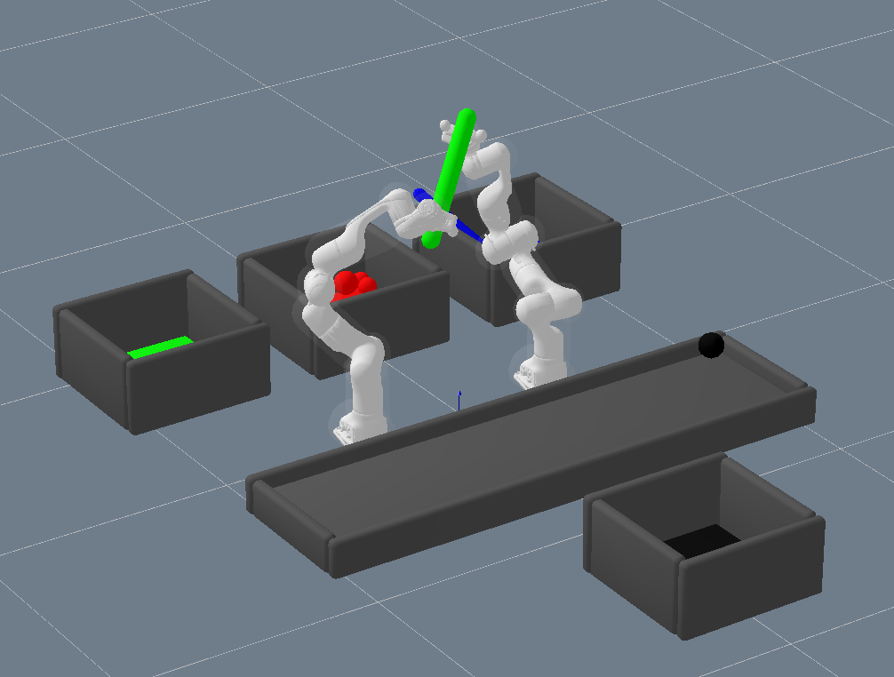

# Sorting Robot

The sorting robot consists of two Panda robot arms.
It sorts objects based on their colors to matching baskets.
This may involve:
- grasping and dropping of objects
- handovers between the robot arms if a basket is not reachable for one arm
- throwing of objects if both arms cannot reach the basket

The robot can handle balls and capsules as objects.

This is a student project done for the
"Robotics and AI: Lab Course" at Technical University of Berlin.

## Setup
The used framework and installation instructions can be found
[here](https://github.com/MarcToussaint/robotics-course).
You have to follow
[these](https://github.com/MarcToussaint/robotics-course#setup-for-robotics-practical-in-simulation)
installation instructions to be able to run the code in this
repository.